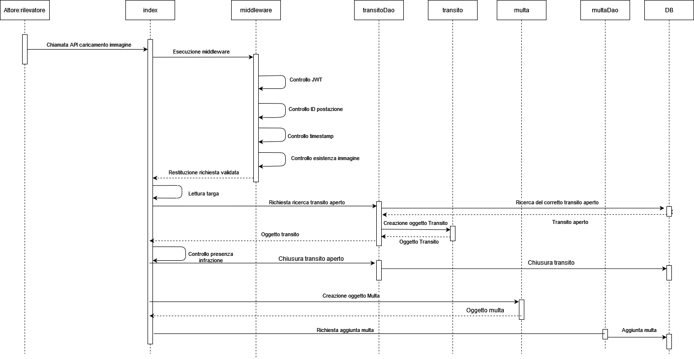
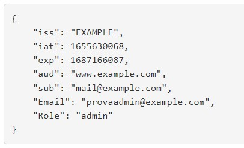
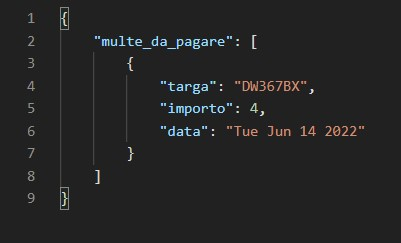

# Progetto-PA
L’applicazione permette di simulare un sistema di rilevazione di velocità di veicoli stradali attraverso coppie di terminali fissi che determinano, a coppie, una tratta. Chiameremo questi terminali postazioni, distinguendoli per tipologia (‘inizio’ o ‘fine’). Viene prevista inoltre l’assegnazione automatica di multe qualora avvenissero delle infrazioni del limite di velocità per una data tratta, le cui informazioni sono conservate all’interno del database. 
Sono anche fornite funzionalità per altre due categorie di utenti, in questo caso umani, ovvero utenti amministratori e gli automobilisti. I primi possono richiedere al sistema informazioni sulle tratte e sul transito che avviene su di esse, mentre i secondi possono controllare le proprie multe per poi pagarle. Le singole funzionalità verranno descritte più nel dettaglio in seguito.
Sia l’applicazione server sia il database sono gestiti tramite container Docker. Sono presenti infatti un Dockerfile e un docker-compose.yml. 
Per eseguire l’applicazione dunque bisogna:
-	Per prima cosa clonare il repository con:``` git clone https://github.com/Ziozimomo/Progetto-PA```
-	Successivamente, supponendo che il sistema sia già configurato con docker e docker-compose, bisogna posizionarsi nella cartella root del progetto, in cui si trovano il Dockerfile e docker-compose.yml
-	Si deve preparare il file .env in cui inserire le variabili d’ambiente da sfruttare
-	A questo punto si costruiscono le immagini (se non già presenti) e si fanno partire i container e la rete che li collega tramite il comando ``` docker-compose up```
-	Per chiudere i container si può eseguire  ``` docker-compose stop``` (in questo caso sarà possibile farli ripartire con  ``` docker-compose start [NOME_CONTAINER]``` successivamente), oppure con  ``` docker-compose down``` se si vuole anche rimuoverli, assieme alla rete.

Il file .env, come menzionato sopra, va costruito autonomamente per poterci inserire tutte le variabili d’ambiente necessarie. Queste sono
-	PORT: la porta interna al container su cui si esporrà il server
-	DATABASE: il nome del database
-	USERNAME: il nome dell’utente che si connette al DB
-	PASSWORD: la password dell’utente per accedere al DB
-	MYSQL_PORT: la porta interna al container su cui si espone il DB
-	EXTERNAL_PORT: la porta del sistema host su cui si mapperà porta interna al container per il server
-	EXTERNAL_DB_PORT: la porta del sistema host su cui si mapperà porta interna al container per il DB
-	HOST????????????: COME LO DEFINISCO??
-	SECRET_KEY: chiave usata per la firma del jwt
## Struttura del codice
Il codice è suddiviso nei seguenti moduli:
-	index- Questo modulo è quello centrale del progetto. Costruisce il server, definisce le rotte e le callback per gestire le richieste. 
-	connection-Questo modulo istanza la connessione al database.
-	DAO-All’interno di questa directory troviamo i DAO, usati per comunicare con il DB
-	Models-In questa directory troviamo i moduli che contengono le classi con cui si modellano le tabelle del DB
-	Middleware-In questo modulo sono definiti i middleware chiamati prima delle effettive callback di gestione delle richieste. 
Come menzionato, si è implementato il pattern DAO per gestire la comunicazione con il database. In questo modo si sono ben separate le funzionalità di gestione delle richieste (gestite da index e dai middleware), la comunicazione con il DB (gestite dai vari DAO), e la modellazione delle tabelle (che si trovano dentro Models). DAO e modelli sono stati costruiti sfruttando la libreria Sequelize, per cui la loro struttura è un po’ diversa dalla definizione classica delle classi ed interfacce che costituiscono i modelli e i DAO.
È stato anche implementato il pattern Middleware per eseguire controlli sulle richieste prima di passarli alle callback di gestione. In questo modo si vogliono identificare richieste mal strutturate che arrivano al server prima di passarle alle effettive funzionalità di elaborazione. I controlli da eseguire sulle varie rotte sono di varia tipologia: sono quindi stati costruiti più middleware che vengono chiamati a catena. Questa tipologia di catena è tendenzialmente definita come “catena di responsabilità”. Ogni middleware esegue un controllo, e se tutto va bene passa la staffetta al middleware successivo. Se invece si incontra un errore la catena è interrotta. 
Il seguente diagramma rappresenta i moduli che compongono le applicazioni, le loro funzionalità e come si legano:


## Funzionamento
Come accennato in precedenza, il sistema prevede l’utilizzo di un database MySQL per la lettura dei dati necessari per svolgere le sue operazioni e per la conservazione delle rilevazioni eseguite (ed eventuali multe ad esse collegate). All’avvio entrambi i container docker, rispettivamente uno per Node.js che contiene il nostro backend e uno per il database MySQL, vengono messi in esecuzione e il sistema si mette in attesa delle possibili richieste dei suoi utenti. Queste ultime sono divise per tipologia di utente: postazione (i terminali fissi responsabili delle rilevazioni su strada), amministratore e automobilista. 

### Funzioni per postazione
Alla postazione viene permesso di inviare al sistema i dati relativi ad una rilevazioni, quali targa del veicolo in formato JSON o per immagine, timestamp e ID della postazione stessa.
Il sistema riceve la richiesta e distingue le operazioni da svolgere a seconda del tipo di Postazione.  
Se la postazione è salvata nel database come ‘inizio’ viene creato un oggetto Transito che valorizza parte dei suoi campi con la targa del veicolo (estratta tramite la libreria Tesseract nel caso in cui venga fornita come immagine), il timestamp preso come TimestampInizio e l’ID relativo alla Tratta a cui appartienela postazione (ricavabile a partire dalla tabella delle postazioni). 
Se invece essa è di tipo ‘fine’, si cerca nel database un transito aperto sulla tratta della postazione con la targa rilevata e, in caso di riscontro, esso viene chiuso e aggiornato con il tempo di uscita, la velocità media del veicolo durante il percorso. Nel caso quest’ultima superi il limite di velocità imposto per la tratta corrispondente, viene anche creata una multa con importo variabile a seconda del tipo di infrazione.


### Funzioni per amministratore
All’amministratore viene permesso di consultare il sistema rispetto ai dati presenti sul database. In particolare è possibile richiedere:

-	La lista dei veicoli transitati in un dato intervallo temporale in una data tratta, unita ad una serie di statistiche quali numero transiti, velocità media, minima e massima dei veicoli e la deviazione standard
-	Le stesse statistiche per un singolo veicolo dati una targa, una tratta e un intervallo di tempo
-	La lista delle tratte con i dettagli relativi alle postazioni che la costituiscono e la distanza tra queste ultime
-	La lista delle multe e il loro relativo stato di pagamento data una targa
-	La lista delle multe non pagate


### Funzioni per automobilisti
Agli automobilisti è permesso di operare sulle multe relative ai propri veicoli, le cui targhe vengono recuperate dal proprio token JWT. In particolare è possibile richiedere:

-	La lista delle proprie multe con relativo stato di pagamento
-	Il pagamento di una multa dato il suo relativo ID


Per soddisfare queste richieste vengono quindi definite le seguenti rotte:

### Postazione
Previa autenticazione JWT (ruolo ‘smartautovelox’):

|Rotta       | Descrizione|
|-----------|------------------------|
|/nuovarilevazione/:postazione (inizio)| Il sistema inserisce un transito aperto con i dati della rilevazione attuale|
|/nuovarilevazione/:postazione (fine)| Il sistema aggiorna il transito aperto con i dati della rilevazione attuale e lo chiude|
|/nuovarilevazione/:postazione (fine con multa)| Il sistema aggiorna il transito con i dati della rilevazione attuale e inserisce|

#### UML: Diagrammi delle sequenze

> /nuovarilevazione/:postazione




### Amministratore
Previa autenticazione JWT (ruolo ‘admin’):

|Rotta       | Descrizione|
|-----------|------------------------|
|/listaveicoli/:tratta| Viene restituita la lista dei veicoli transitati in un dato intervallo temporale in una data tratta con le statistiche su transiti e velocità|
|/stat/:targa/:tratta|Vengono restituite tutte le statistiche sui transiti di un veicolo sulla tratta calcolate su un dato intervallo di tempo|
|/tratte| Viene restituita la lista delle tratte con i dettagli relativi alle postazioni che la costituiscono e la distanza|
|/multe/:targa| Viene restituita la lista delle multe di una targa e il loro relativo stato di pagamento|
|/multeaperte| Viene restituita la lista di tutte le multe non pagate|

#### UML: Diagrammi delle sequenze

> /listaveicoli/:tratta


> /stat/:targa/:tratta


> /tratte


> /multe/:targa


> /multeaperte


### Automobilista
Previa autenticazione JWT (ruolo ‘car_owner’):

|Rotta       | Descrizione|
|-----------|------------------------|
|/propriemulte| Viene restituita la lista delle proprie multe con relativo stato di pagamento|
|/pagamento/:idMulta| Viene cambiato lo stato di pagamento di una multa cambiando il suo attributo “Pagato”|

#### UML: Diagrammi delle sequenze

> /propriemulte


> /pagamento/:idMulta


## Descrizione delle API
 In questa sezione si andrà più nel dettaglio sulle varie chiamate HTTP eseguibili all'applicazione, specificando i vari parametri da inserire e mostrando per ognuna di esse un esempio, con i relativi risultati. Questi esempi verranno presentati tramite il software *Postman*
Gli esempi mostrati si baseranno sulla seguenta lista di postazioni e tratte, che è quella inserita con il seeding iniziale del DB:


 Una nota che vale per tutte le API. Un parametro da allegare alla chiamata è sempre un JSON Web Token, JWT in breve. Esso è sfruttato per controllare il ruolo dell'utente (e in alcuni casi anche per altro).
 I tre ruoli sono: "smartautovelox", "admin" e "car-owner". Utenti di ruolo diverso hanno a disposizione API diverse.
 Il JWT viene firmato tramite l'algoritmo HS256 (HMAC+SHA256). La chiave segreta da utilizzare viene specificata lato backend nel file .env. 
In Postaman il JWT è inserito nella sezione “Authorization”:


 ### Utente *smartautovelox*
Il JWT di un utente con questo ruolo dovrà contenere il campo “Role”, con valore “smartautovelox”.Sarà della forma seguente:


 L'utente di tipologia *smartautovelox*, che rappresenta una postazione autovelox,  può eseguire una sola chiamata:
 
> Metodo HTTP: **POST**. Rotta: **'/nuovarilevazione/:postazione'**

  Alla chiamata vanno allegati tre parametri e un file:
  

 1. L'indice che indica la postazione che ha eseguito la chiamata. Questo parametro è specificato nella rotta.
 2. Il timestamp che indica quando la rilevazione è stata eseguita. Questo è da porre nell'header della chiamata. Il timestamp deve essere in formato Unix epoch, con precisione al millisecondo. La chiave da associare al timestamp è "timestamp". 
 3. Un jwt per l'autenticazione. Questo jwt deve contenere il campo "Role", e il valore deve essere "smartauvelox". 
 4. Il file da cui estrarre la targa. Questo file può essere di due tipologie: un'immagine (di formato jpg o png) che contiene la targa, oppure un file JSON con il campo "targa". In entrambi i casi il file va spedito come “form-data”, in modo che si possa associare al file la chiave “file”, tramite la quale il sistema la estrae dal body. NOTA IMPORTANTE: per limitazioni di lettura della libreria utilizzata per la scansione delle immagini, Tesseract, l'immagine deve contenere esclusivamente la targa, senza elementi esterni che vadano a confondere Tesseract. 
  
Un esempio di chiamata all'API è la seguente:


Il timestamp, come detto prima, è inserito nell’header:


L’immagine/JSON fa invece parte del body della richiesta.


Se la postazione è una postazione di inizio tratta,una volta processata la richiesta verrà generato un nuovo transito sul DB:


Se invece la postazione è finale, il transito verrà chiuso:


Inoltre, se viene superato il limite di velocità verrà generata una multa da pagare:


### Utente *admin*
Il JWT associato ad un utente di tipo admin deve avere il campo “Role”, di valore “admin”. Avrà quindi la forma seguente:



A questa tipologia di utente è associata una serie di possibili chiamate HTTP.

> Metodo HTTP: **GET**. Rotta: **'/listaveicoli/:tratta'**

I parametri da associare alla chiamata sono:
1.	L’indice che indica la tratta richiesta. Va inserito nella rotta. 
2.	Il JWT
3.	Opzionalmente, si può specificare l’intervallo temporale di ricerca. In questo caso vanno aggiunti due parametri nell’header, chiamati “inizio” e “fine”. Le date devono avere la sintassi: YYYY-MM-DD. 


Un esempio di chiamata all'API è la seguente:


Un esempio delle date nell’header sono il seguente:


Eseguita la chiamata, la risposta che il richiedente otterrà sarà di questa forma:


> Metodo HTTP: **GET**. Rotta: **’/stat/:targa/:tratta’'**

I parametri da associare alla chiamata sono:
1.	La targa sulla quale si vogliono calcolare le statistiche, da inserire nella rotta.
2.	L’indice della tratta sulla quale si vogliono calcolare le statistiche, anch’esso da inserire nella rotta.
3.	Il JWT

Un esempio di chiamata all'API è la seguente:


Eseguita la chiamata, la risposta che il richiedente otterrà sarà di questa forma:


> Metodo HTTP: **GET**. Rotta: **’/tratte’'**

In questo caso l’unico parametro richiesto è il JWT.

Un esempio di chiamata all'API è la seguente:


Eseguita la chiamata, la risposta che il richiedente otterrà sarà di questa forma:


> Metodo HTTP: **GET**. Rotta: **’/multe/:targa**

I parametri da associare alla chiamata sono:

1.	La targa relativa all’auto di cui si vogliono ottenere le multe
2.	Il JWT

Un esempio di chiamata all'API è la seguente:


Eseguita la chiamata, la risposta che il richiedente otterrà sarà di questa forma:


> Metodo HTTP: **GET**. Rotta: **’/multeaperte**

In questo caso l’unico parametro richiesto è il JWT.

Un esempio di chiamata all'API è la seguente:


Eseguita la chiamata, la risposta che il richiedente otterrà sarà di questa forma:




 ### Utente *car-owner*
Il JWT associato a questo ruolo deve contenere un campo “Ruolo”, con valore “car-owner”. Inoltre serve anche un altro campo, chiamato “Targhe”. Il valore associato può essere una singola stringa contenente la propria targa, oppure un array di stringhe nel caso in cui all’utente siano associate più targhe.
Un esempio di JWT è il seguente:


A questo ruolo sono associati due metodi.

> Metodo HTTP: **GET**. Rotta: **’/propriemulte**

In questo caso l’unico parametro richiesto è il JWT.

Un esempio di chiamata all'API è la seguente:


Eseguita la chiamata, la risposta che il richiedente otterrà sarà di questa forma:


> Metodo HTTP: **PATCH**. Rotta: **’/pagamento/:idMulta**

I parametri da associare alla chiamata sono:
1.	L’id della multa da pagare, da inserire nella rotta
2.	Il JWT

Un esempio di chiamata all'API è la seguente:


Eseguita la chiamata, la risposta che il richiedente otterrà sarà di questa forma:


La multa sarà quindi segnalata come pagata nel back-end:


