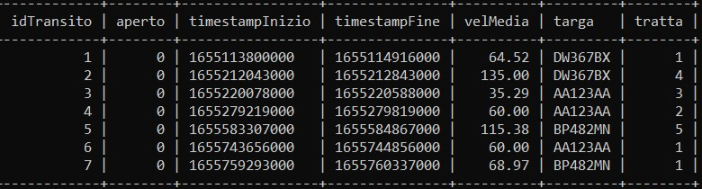
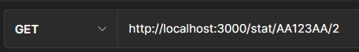
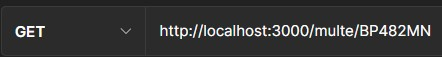
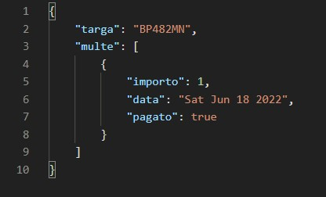

# Progetto-PA
Questa applicazione permette di simulare un sistema di rilevazione di velocità di veicoli stradali attraverso coppie di terminali fissi che determinano delle tratte. Chiameremo questi terminali "postazioni", distinguendoli per tipologia (‘inizio’ o ‘fine’). Viene prevista inoltre l’assegnazione automatica di multe qualora avvenissero delle infrazioni del limite di velocità per una data tratta, le cui informazioni sono conservate all’interno del database. 
Sono anche fornite funzionalità per altre due categorie di utenti, in questo caso umani, ovvero utenti amministratori e gli automobilisti. I primi possono richiedere al sistema informazioni sulle tratte e sul transito che avviene su di esse, mentre i secondi possono controllare le proprie multe per poi pagarle. Le singole funzionalità verranno descritte più nel dettaglio in seguito.
Sia l’applicazione server sia il database sono gestiti tramite container Docker. Sono presenti infatti un Dockerfile e un docker-compose.yml. 
Per eseguire l’applicazione dunque bisogna:
-	Per prima cosa clonare il repository con: ```git clone https://github.com/Ziozimomo/Progetto-PA```
-	Successivamente, supponendo che il sistema sia già configurato con docker e docker-compose, bisogna posizionarsi nella cartella root del progetto, in cui si trovano il Dockerfile e docker-compose.yml
-	Si deve preparare il file .env in cui inserire le variabili d’ambiente da sfruttare, e va posto nella stessa cartella in cui sono presenti il Dockerfile e docker-compose.yml.
-	A questo punto si costruiscono le immagini e si fanno partire i container e la rete che li collega tramite il comando ``` docker-compose up```
-	Per chiudere i container si può eseguire ``` docker-compose down```, tramite il quale essi vengono anche rimossi, assieme alla rete.

Il file .env, come menzionato sopra, va costruito autonomamente per poterci inserire tutte le variabili d’ambiente necessarie. Queste sono:
-	PORT: la porta interna al container su cui si esporrà il server
-	HOST: l'host su cui si contatterà il server
-	USER: il nome dell’utente che si connetterà al DB. Verrà creato con la costruzione dell'immagine di mysql. **DEVE** essere diverso da "root"
-	PASSWORD: la password dell’utente sopracitato per accedere al DB
-	MYSQL_PORT: la porta interna al container su cui si espone il DB
-	EXTERNAL_PORT: la porta del sistema host su cui si mapperà la porta interna al container del server
-	SECRET_KEY: la chiave usata per la firma del JWT

**NOTA** Alla fine dell'inizializzazione del container del web server comparirà un messaggio del tipo "server in ascolto su: http://0.0.0.0:3000". La porta che viene specificata nel messaggio **NON** è la porta interna al container, ovvero quella specificata dalla variabile d'ambiente PORT. È invece la porta del sistema host, quella specificata dalla variabile d'ambiente EXTERNAL_PORT. Questo è fatto per rendere più semplice capire a qualche porta bisogna connettersi. Ovviamente questo non è un problema nel caso in cui si decida di sfruttare la stessa porta sia nel container sia nell'host.
## Struttura del codice
Il codice è suddiviso nei seguenti moduli:
-	**index** - Questo modulo è quello centrale del progetto. Costruisce il server, definisce le rotte e le callback per gestire le richieste. 
-	**connection** - Questo modulo istanza la connessione al database.
-	**DAO** - All’interno di questa directory troviamo i DAO, usati per comunicare con il DB
-	**Models** - In questa directory troviamo i moduli che contengono le classi con cui si modellano le tabelle del DB
-	**Middleware** - In questo modulo sono definiti i middleware chiamati prima delle effettive callback di gestione delle richieste. 

Come menzionato, si è implementato il pattern DAO per gestire la comunicazione con il database. In questo modo si sono ben separate le funzionalità di gestione delle richieste (gestite da index e dai middleware), la comunicazione con il DB (gestite dai vari DAO), e la modellazione delle tabelle (tramite le classi che si trovano dentro Models). DAO e modelli sono stati costruiti sfruttando la libreria Sequelize, per cui la loro struttura è un po’ diversa da quella classica delle classi ed interfacce dei modelli e dei DAO.
È stato anche implementato il pattern Middleware per eseguire controlli sulle richieste prima di passarli alle callback di gestione. In questo modo si vogliono identificare richieste mal strutturate che arrivano al server prima di passarle alle effettive funzionalità di elaborazione. I controlli da eseguire sulle varie rotte sono di varia tipologia: sono quindi stati costruiti più middleware che vengono chiamati a catena. Questa tipologia di catena è tendenzialmente definita come “catena di responsabilità”. Ogni middleware esegue un controllo, e se tutto va bene passa la staffetta al middleware successivo. Se invece si incontra un errore la catena è interrotta e viene restituito un errore. 

Il seguente diagramma rappresenta i moduli che compongono le applicazioni, le loro funzionalità e come si legano:


## Funzionamento
Come accennato in precedenza, il sistema prevede l’utilizzo di un database SQL, gestito con il DBMS MySQL, per la lettura dei dati necessari per svolgere le sue operazioni e per la conservazione delle rilevazioni eseguite (e delle eventuali multe ad esse collegate). All’avvio entrambi i container, rispettivamente uno per il backend e uno per il database, vengono messi in esecuzione e il sistema si mette in attesa delle richieste degli utenti. Si sono dovuti eseguire accorgimenti per assicurarsi che il container del backend partisse solo quando il database ha completato la sua inizializzazione. Infatti l'opzione *depends-on* nel file docker-compose.yml non era sufficiente, dato che garantiva esclusivamente che i container partissero nel giusto ordine, ma non forzava quello del backend ad aspettare fino alla fine dell'inizializzazione dell'altro container. Si è deciso quindi di utilizzare uno script bash, *wait-for-it.sh* che mette in attesa il container del backend fino a che non rileva che l'altro è pronto. Lo script è stato ottenuto da questo repository: https://github.com/vishnubob/wait-for-it.

Le richieste eseguibili sono divise per tipologia di utente: postazione (i terminali fissi responsabili delle rilevazioni su strada), amministratore e automobilista. 

### Funzioni per postazione
Alla postazione viene permesso di inviare al sistema i dati relativi ad una rilevazione, ovvero: la targa del veicolo, in formato JSON o tramite immagine, il timestamp e l'ID della postazione stessa.
Il sistema riceve la richiesta e distingue le operazioni da svolgere a seconda del tipo di postazione.  
Se la postazione è salvata nel database come ‘inizio’ viene creato un oggetto Transito che valorizza parte dei suoi campi con la targa del veicolo (estratta tramite la libreria Tesseract nel caso in cui venga fornita come immagine), il timestamp, che sarà quello di "apertura della tratta", e l’ID relativo alla tratta a cui appartienela la postazione (ricavabile a partire dalla tabella delle postazioni). 
Se invece essa è di tipo ‘fine’, si cerca nel database un transito aperto dalla targa rilevata sulla tratta relativa alla postazione che ha mandato la richiesta e, in caso di riscontro, esso viene chiuso e aggiornato con il tempo di uscita e la velocità media del veicolo durante il percorso. Nel caso quest’ultima superi il limite di velocità imposto per la tratta corrispondente, viene anche creata una multa con importo variabile a seconda del tipo di infrazione.


### Funzioni per amministratore
All’amministratore viene permesso di consultare i dati presenti nel sistema e di eseguire semplici analisi. In particolare è possibile richiedere:

-	La lista dei veicoli transitati in un dato intervallo temporale e in una data tratta, unita ad una serie di statistiche quali numero dei transiti, velocità media, minima e massima dei veicoli e la relativa deviazione standard.
-	Le stesse statistiche per un singolo veicolo, date una targa e una tratta.
-	La lista delle tratte con i dettagli relativi alle postazioni che la costituiscono e la distanza tra queste ultime.
-	La lista delle multe e il loro relativo stato di pagamento, data una targa.
-	La lista di tutte le multe attualmente non pagate.


### Funzioni per automobilisti
Agli automobilisti è permesso di operare sulle multe relative ai propri veicoli, le cui targhe vengono recuperate dal proprio JWT. In particolare è possibile:

-	Richiedere la lista delle proprie multe con relativo stato di pagamento
-	Pagare una multa, dato il suo relativo ID.


Per soddisfare queste richieste vengono quindi definite le seguenti rotte:

### Postazione

|Rotta       | Descrizione|
|-----------|------------------------|
|/nuovarilevazione/:postazione| Il sistema inserisce un transito aperto con i dati della rilevazione attuale o chiude uno già aperto. Se necessario crea una multa.|

#### UML: Diagrammi delle sequenze

> /nuovarilevazione/:postazione
Postazione di inizio tratta:

Postazione di fine tratta:

Postazione di fine tratta con infrazione e relativa generazione di multa:


### Amministratore

|Rotta       | Descrizione|
|-----------|------------------------|
|/listaveicoli/:tratta| Viene restituita la lista dei veicoli transitati in un dato intervallo temporale in una data tratta con le statistiche su transiti e velocità|
|/stat/:targa/:tratta|Vengono restituite tutte le statistiche sui transiti di un veicolo sulla tratta calcolate su un dato intervallo di tempo|
|/tratte| Viene restituita la lista delle tratte con i dettagli relativi alle postazioni che la costituiscono e la distanza|
|/multe/:targa| Viene restituita la lista delle multe di una targa e il loro relativo stato di pagamento|
|/multeaperte| Viene restituita la lista di tutte le multe non pagate|

#### UML: Diagrammi delle sequenze

> /listaveicoli/:tratta


> /stat/:targa/:tratta


> /tratte


> /multe/:targa


> /multeaperte


### Automobilista

|Rotta       | Descrizione|
|-----------|------------------------|
|/propriemulte| Viene restituita la lista delle proprie multe con relativo stato di pagamento|
|/pagamento/:idMulta| Viene cambiato lo stato di pagamento di una multa, modificando il suo attributo “Pagato”|

#### UML: Diagrammi delle sequenze

> /propriemulte


> /pagamento/:idMulta


## Descrizione delle API, con esempi
In questa sezione si andrà più nel dettaglio sulle varie chiamate HTTP eseguibili, specificando i vari parametri da inserire e mostrando per ognuna di esse un esempio, con i relativi risultati. Questi esempi verranno presentati tramite il software *Postman*.
Gli esempi mostrati si baseranno sulla seguente lista di postazioni e tratte, che è quella inserita con il seeding iniziale del DB:


Si supporrà inoltre di avere i seguenti transiti e multe già presenti nel DB (anche in questo caso inseriti con il seeding):



Una nota che vale per tutte le API. A qualunque chiamata è sempre da allegare come parametro un JSON Web Token, JWT in breve. Esso è utilizzato per controllare il ruolo dell'utente e, nel caso degli automobilisti, anche recuperare le targhe a loro associate.
I tre ruoli sono: "smartautovelox", "admin" e "car-owner". Utenti di ruolo diverso hanno a disposizione API diverse.
Il JWT viene firmato tramite l'algoritmo HS256 (HMAC+SHA256). La chiave segreta da utilizzare viene specificata lato backend nel file .env, come descritto nel primo paragrafo. 
In Postman il JWT è inserito nella sezione “Authorization”:


 ### Utente *smartautovelox*
Il JWT di un utente con questo ruolo dovrà contenere il campo “Role”, con valore “smartautovelox”. Sarà della forma seguente:


 L'utente di tipologia *smartautovelox*, che rappresenta una postazione autovelox, può eseguire una sola chiamata:
 
> Metodo HTTP: **POST**. Rotta: **'/nuovarilevazione/:postazione'**

  Alla chiamata vanno allegati tre parametri e un file:
  

 1. L'indice che indica la postazione che ha eseguito la chiamata. Questo parametro è un ID ed è specificato nella rotta.
 2. Il timestamp che indica quando la rilevazione è stata eseguita. Questo è da porre nell'header della chiamata. Il timestamp deve essere in formato Unix epoch, con precisione al millisecondo. La chiave da associare al timestamp è "timestamp". 
 3. Il JWT. 
 4. Il file da cui estrarre la targa. Questo file può essere di due tipologie: un'immagine (di formato jpg o png) che contiene la targa, oppure un file JSON con il campo "targa". In entrambi i casi il file va spedito come “form-data”, in modo che si possa associare al file la chiave “file”, tramite la quale il sistema la estrae dal body della richiesta. NOTA IMPORTANTE: per limitazioni di lettura della libreria utilizzata per la scansione delle immagini, Tesseract, l'immagine deve contenere esclusivamente la targa, senza elementi esterni che vadano a confondere la scansione dell'immagine. 
  
Un esempio di chiamata all'API è la seguente:


Il timestamp, come detto prima, è inserito nell’header:


Il file, che sia esso un JSON o un'immagine PNG/JPG, fa invece parte del body della richiesta:


Se la postazione è una postazione di inizio tratta, una volta processata la richiesta verrà generato un nuovo transito sul DB:


Se invece la postazione è finale, il transito verrà chiuso:


Inoltre, se viene superato il limite di velocità verrà generata una multa da pagare, simile alla seguente:


### Utente *admin*
Il JWT associato ad un utente di tipo admin deve avere il campo “Role”, di valore “admin”. Avrà quindi la forma seguente:


A questa tipologia di utente è associata una serie di possibili chiamate HTTP.

> Metodo HTTP: **GET**. Rotta: **'/listaveicoli/:tratta'**

I parametri da associare alla chiamata sono:
1.	L’indice che indica la tratta richiesta. Va inserito nella rotta. 
2.	Il JWT.
3.	Opzionalmente, si può specificare l’intervallo temporale di ricerca. In questo caso vanno aggiunti due parametri nell’header, chiamati “inizio” e “fine”. Le date devono avere la seguente sintassi: YYYY-MM-DD. 


Un esempio di chiamata all'API è la seguente:


Un esempio delle date nell’header è il seguente:


Eseguita la chiamata, la risposta che il richiedente otterrà sarà di questa forma:


> Metodo HTTP: **GET**. Rotta: **’/stat/:targa/:tratta’**

I parametri da associare alla chiamata sono:
1.	La targa sulla quale si vogliono calcolare le statistiche, da inserire nella rotta.
2.	L’indice della tratta sulla quale si vogliono calcolare le statistiche, anch’esso da inserire nella rotta, dopo la targa.
3.	Il JWT

Un esempio di chiamata all'API è la seguente:



Eseguita la chiamata, la risposta che il richiedente otterrà sarà di questa forma:


> Metodo HTTP: **GET**. Rotta: **’/tratte’**

In questo caso l’unico parametro richiesto è il JWT.

Un esempio di chiamata all'API è la seguente:


Eseguita la chiamata, la risposta che il richiedente otterrà sarà di questa forma:


> Metodo HTTP: **GET**. Rotta: **’/multe/:targa’**

I parametri da associare alla chiamata sono:

1.	La targa relativa all’auto di cui si vogliono ottenere le multe, da inserire nella rotta.
2.	Il JWT.

Un esempio di chiamata all'API è la seguente:



Eseguita la chiamata, la risposta che il richiedente otterrà sarà di questa forma:




> Metodo HTTP: **GET**. Rotta: **’/multeaperte’**

In questo caso l’unico parametro richiesto è il JWT.

Un esempio di chiamata all'API è la seguente:


Eseguita la chiamata, la risposta che il richiedente otterrà sarà di questa forma:


 ### Utente *car-owner*
Il JWT associato a questo ruolo deve contenere un campo “Role”, con valore “car-owner”. Inoltre serve anche un altro campo, chiamato “Targhe”. Il valore associato può essere una singola stringa contenente la propria targa, oppure un array di stringhe nel caso in cui all’utente siano associate più targhe.
Un esempio di JWT è il seguente:


A questo ruolo sono associati due metodi.

> Metodo HTTP: **GET**. Rotta: **’/propriemulte’**

In questo caso l’unico parametro richiesto è il JWT.

Un esempio di chiamata all'API è la seguente:


Eseguita la chiamata, la risposta che il richiedente otterrà sarà di questa forma:


> Metodo HTTP: **PATCH**. Rotta: **’/pagamento/:idMulta’**

I parametri da associare alla chiamata sono:
1.	L’id della multa da pagare, da inserire nella rotta.
2.	Il JWT.

Un esempio di chiamata all'API è la seguente:


Supponendo di avere una multa da pagare relativa all'utente richiedente come la seguente:


Eseguita la chiamata, la risposta che il richiedente otterrà sarà un semplice messaggio di pagamento eseguito.

La multa sarà quindi segnalata come pagata nel back-end:


## Gestione delle situazioni di errore
Gran parte degli errori è gestita semplicemente notificando il richiedente che qualcosa è andato storto o che la richiesta è mal formata.
L'aggiunta di rilevazioni può però portare ad alcune situazioni di errore che vengono gestite in maniera un poco più complessa, e che quindi vale la pena descrivere più approfonditamente:
1.  **Targa illeggibile** - Nel caso in cui Tesseract non riesca ad estrarre una targa sensata viene loggato un errore in un file log.txt, in cui si segnala che una certa postazione ha spedito una rilevazione, con un certo timestamp, la cui targa risulta illeggibile. Alla postazione viene ritornata una risposta con status code 400. Non viene creato alcun transito, dato che in assenza della targa le altre informazioni sono inutilizzabili.
2. **Rilevazione finale in assenza di quella iniziale** - Nel caso in cui venga rilevata un passaggio di un'automobile da una postazione di fine tratta prima che lo faccia una di inizio tratta ci si trova chiaramente in una situazione di errore. È impossibile riuscirne a determinare la causa, e perciò questo errore si gestisce nello stesso identico modo del caso precedente.
3. **Rilevazione iniziale e finale con lo stesso timestamp** - Nel caso in cui arrivi una nuova rilevazione da una postazione di fine tratta che fornisce lo stesso timestamp che aveva fornito quella di inizio tratta precedentemente ci si trova in una situazione di errore. Anche in questo caso si logga l'errore e si restituisce uno status code 400.
4. **Transito aperto per troppo tempo** - Se un transito rimane aperto per troppo tempo non ha più senso chiuderlo con la successiva rilevazione di fine tratta. Per questo nell'applicazione è definita un'operazione di pulizia del DB, che cancella periodicamente transiti aperti da troppo tempo. Attualmente l'operazione viene eseguita ogni 100 secondi per motivi di testing, e cancella ogni transito aperto più vecchio di due ore rispetto alla data attuale. Sono comunque valori semplicemente modificabili.

## Suddivisione del lavoro
Lavoro comune:

Progettazione del software - README

Simone Salvoni:

index, Middleware, Connection - testing dell'applicazione

Giovanni Recchi:

DAO, Models - Progettazione del database, creazione del seeding
